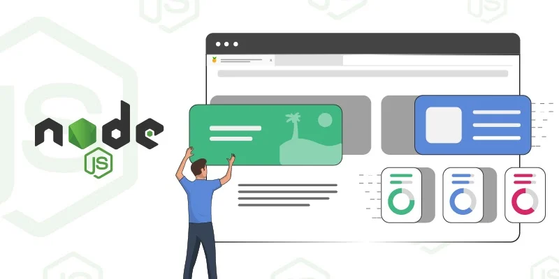

# Node Authentication API 🌐

## Project Name: Task Manager API 🔐

### A project for building secure authentication and task management using Express.js, Prisma, and JWT token.

[](https://github.com/Ravikisha/Node-Authentication-API)
[](CONTRIBUTING.md)

Welcome to the Node Authentication API, a secure and robust API for user authentication and task management. This API can be used in any frontend application to manage user authentication and tasks efficiently.

## Project Overview 🚀

The Node Authentication API is designed to provide a solid foundation for user authentication and task management in your application. It employs JWT (JSON Web Tokens) for secure user authentication and Prisma as the database ORM to manage tasks efficiently. This API is ready to be integrated into your frontend application, making user registration, authentication, and task management a breeze.

## Features and Functionality 🌟

- User Registration and Authentication using JWT.
- Secure Password Hashing.
- Task Creation, Update, and Deletion.
- Task Filtering and Sorting.
- User Profile Management.
- Token Refresh Mechanism for Enhanced Security.

## Technology Stack 🛠️

<p align="left">


</p>

## Installation Steps 📦

To set up the project locally, follow these steps:

1. **Clone the Repository:**

   ```bash
   git clone https://github.com/Ravikisha/Node-Authentication-API.git
   cd node-authentication-api
   ```

2. **Install Dependencies:**

   Install the required Node.js packages.

   ```bash
   npm install
   ```

3. **Create a `.env` File:**

   Create a `.env` file in the project's root directory and add the following configurations:

   ```
   PORT=your-port-number
   DATABASE_URL=your-database-url
   JWT_SECRET=your-jwt-secret
   ```

4. **Set Up Prisma:**

   Run the following commands to set up the database using Prisma:

   ```bash
   npx prisma migrate dev
   npx prisma generate
   ```

5. **Start the Server:**

   Launch the Express server.

   ```bash
   npm start
   ```

6. **Access the API:**

   The API is now running and ready to be used in your frontend application.

## How to Contribute 🤝

Contributions are welcome! If you'd like to contribute to the Node Authentication API project, please review the [CONTRIBUTING.md](CONTRIBUTING.md) file for guidelines and instructions.

## License 📜

This project is open-source and is licensed under the MIT License. See the [LICENSE](LICENSE) file for details.

The Node Authentication API simplifies user authentication and task management, allowing you to focus on building your frontend application. It's open for contributions and ready to empower your projects. 🚀🔒

For more information, contact us at [@Ravi Kishan](mailto:ravikishan63392@gmail.com).